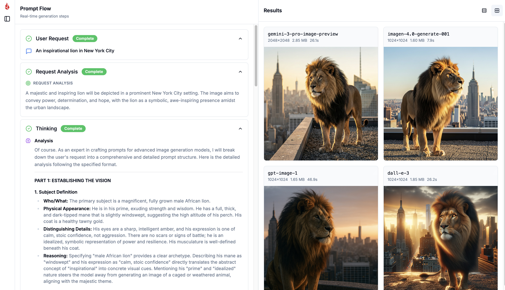

# 🎨 Image Generation Prompt Flow

**Multi-Provider AI Image Generation** with real-time prompt flow visualization and [Backblaze B2](https://www.backblaze.com/b2/cloud-storage.html?utm_source=github&utm_medium=referral&utm_campaign=ai_artifacts&utm_content=promptflow) cloud storage.

A polished reference application demonstrating **side-by-side comparison** of OpenAI and Google Gemini image generation models, with transparent streamed prompt engineering workflow and production-ready storage architecture.

## 🚀 Technologies

- **[Next.js 14+](https://nextjs.org)** - React framework with App Router and Server Actions
- **[TypeScript](https://www.typescriptlang.org)** - Type-safe development with strict mode
- **[OpenAI gpt-image-1](https://platform.openai.com/docs/guides/images)** - DALL-E 3 image generation API
- **[Google Gemini Imagen 3.0](https://ai.google.dev/gemini-api/docs/imagen)** - State-of-the-art text-to-image generation
- **[Backblaze B2](https://www.backblaze.com/b2/cloud-storage.html?utm_source=github&utm_medium=referral&utm_campaign=ai_artifacts&utm_content=promptflow)** - S3-compatible cloud storage at $6/TB/month
- **[Drizzle ORM](https://orm.drizzle.team)** - Type-safe database queries with SQLite
- **Server-Sent Events** - Real-time streaming of generation pipeline

## ✨ What This Demonstrates

- **Multi-Provider Image Generation**: Compare OpenAI and Google Gemini outputs side-by-side
- **Real-time Prompt Flow**: Stream generation pipeline steps (planning → thinking → prompt construction → generation)
- **Version History**: Track multiple generation attempts per prompt with full lineage
- **Cost-effective Storage**: Store generated images in Backblaze B2 with presigned URLs
- **Production Architecture**: SQLite database with Drizzle ORM for tracking generations and assets
- **Prompt Engineering Transparency**: Show LLM reasoning and prompt optimization process



## 🚀 Quick Start

### Prerequisites

- **Node.js 18+** - [Download here](https://nodejs.org/)
- **[Backblaze B2 Account](https://www.backblaze.com/sign-up/cloud-storage?utm_source=github&utm_medium=referral&utm_campaign=ai_artifacts&utm_content=promptflow)** (free tier available)
  - Create a bucket
  - Generate an Application Key with `readFiles`, `writeFiles` permissions
- **[OpenAI API Key](https://platform.openai.com/api-keys)** (for DALL-E 3 / gpt-image-1)
- **[Google AI API Key](https://aistudio.google.com/app/apikey)** (for Gemini Imagen 3.0)

### 1. Clone & Install

```bash
git clone https://github.com/backblaze-b2-samples/image-generation-prompt-flow.git
cd image-generation-prompt-flow
npm install
```

### 2. Configure Environment

```bash
cp .env.example .env
```

Edit `.env` with your credentials:

```env
# Database
DATABASE_URL=./data/sqlite.db

# Backblaze B2 (S3-compatible)
B2_S3_ENDPOINT=https://s3.us-west-004.backblazeb2.com
B2_S3_REGION=us-west-004
B2_S3_ACCESS_KEY_ID=your_key_id
B2_S3_SECRET_ACCESS_KEY=your_secret_key
B2_S3_BUCKET=your-bucket-name
B2_S3_PRESIGN_TTL_SECONDS=900

# OpenAI (DALL-E 3)
OPENAI_API_KEY=sk-...

# Google AI (Gemini Imagen 3.0)
GOOGLE_AI_API_KEY=...
```

> Get your B2 endpoint and region from your [bucket details page](https://secure.backblaze.com/b2_buckets.htm?utm_source=github&utm_medium=referral&utm_campaign=ai_artifacts&utm_content=promptflow)

### 3. Initialize Database

```bash
./scripts/init-db.sh
```

Or manually:
```bash
npm run db:push
```

### 4. Start the App

```bash
npm run dev
```

**That's it!** Open **http://localhost:3000** in your browser.

### 5. Use the App

1. Enter an image generation prompt (e.g., "A futuristic cityscape at sunset")
2. Select providers (OpenAI, Gemini, or both)
3. Click **"Generate"**
4. Watch the real-time prompt flow in the middle panel
5. Compare provider outputs side-by-side in the right panel

> 📖 For detailed setup instructions, see [SETUP.md](SETUP.md)

## Architecture

```
User → Prompt Input → Next.js Server Action
                    ↓
            Request Analysis (LLM)
                    ↓
            Thinking Process (LLM)
                    ↓
        Prompt Construction (LLM)
                    ↓
    Parallel Generation: OpenAI + Gemini
                    ↓
    Generated Images → B2 Storage
                    ↓
        SQLite DB (Drizzle ORM)
                    ↓
    Client UI (SSE Streaming)
```

### Flow

1. User enters generation prompt in web UI
2. Server Action initiates generation pipeline with SSE streaming
3. **Action Plan Phase**: LLM analyzes intent, subjects, style requirements
4. **Thinking Phase**: LLM reasons through prompt optimization strategy
5. **Prompt Construction**: LLM generates provider-optimized prompts
6. **Parallel Generation**: Both OpenAI and Gemini APIs called simultaneously
7. Generated images uploaded to B2 with presigned URLs
8. Database stores generation metadata, run versions, and asset references
9. Client displays side-by-side comparison with full prompt flow history

### Database Schema

- **`generations`**: User prompts and metadata
- **`runs`**: Provider-specific attempts with version tracking
- **`assets`**: Generated images with B2 storage keys and URLs

### Three-Panel UI

1. **Left Panel**: Generation list with new prompt form
2. **Middle Panel**: Real-time prompt flow visualization (SSE streaming)
3. **Right Panel**: Side-by-side provider comparison view

## 🎯 Use Cases

Perfect for demonstrating **transparent AI image generation workflows** for:

- **Prompt Engineering Research**: Study how prompts are optimized for different models
- **Model Comparison**: Evaluate OpenAI vs Gemini output quality and style
- **Multi-Provider Workflows**: Build applications that hedge across providers
- **Marketing Teams**: Generate multiple creative variations from single brief
- **Product Design**: Compare AI-generated design concepts
- **Educational Tools**: Teach prompt engineering and AI image generation
- **Version Control**: Track generation history and iterate on prompts

## 🔧 Technical Details

### Image Generation Models

**OpenAI (gpt-image-1 / DALL-E 3)**
- **Resolution**: 1024x1024, 1792x1024, 1024x1792
- **Quality**: Standard or HD
- **Style**: Natural or Vivid
- **Pricing**: ~$0.04-0.12 per image

**Google Gemini (Imagen 3.0)**
- **Resolution**: 1024x1024, 1536x1536, up to 2048x2048
- **Quality**: High-fidelity photorealism
- **Aspect Ratios**: Square, landscape, portrait
- **Pricing**: Varies by resolution

### Prompt Flow Pipeline

The application uses a multi-stage LLM pipeline to optimize prompts:

1. **Action Plan**: Analyze user intent and extract key attributes
2. **Thinking**: Reason through prompt optimization strategies
3. **Prompt Construction**: Generate provider-specific optimized prompts
4. **Generation**: Execute parallel API calls

All stages stream via Server-Sent Events for real-time visibility.

### Storage

- **Provider**: [Backblaze B2](https://www.backblaze.com/b2/cloud-storage.html?utm_source=github&utm_medium=referral&utm_campaign=ai_artifacts&utm_content=promptflow)
- **API**: S3-compatible with presigned URLs
- **Pricing**: $6/TB/month storage, uploads FREE
- **TTL**: Configurable presigned URL expiration (default 900s)
- **Documentation**: [B2 S3-Compatible API Docs](https://www.backblaze.com/b2/docs/s3_compatible_api.html?utm_source=github&utm_medium=referral&utm_campaign=ai_artifacts&utm_content=promptflow)

### Database

- **Engine**: SQLite with better-sqlite3
- **ORM**: Drizzle with type-safe queries
- **Migrations**: Schema managed via drizzle-kit
- **Schema**: Generations, runs, assets with relational queries

### Streaming Architecture

- **Protocol**: Server-Sent Events (SSE)
- **Transport**: Next.js Server Actions with streaming responses
- **Events**: Typed event system for each pipeline stage
- **Client**: EventSource API with automatic reconnection

## Deployment

### Deploy to Vercel

```bash
# Install Vercel CLI
npm i -g vercel

# Deploy
vercel
```

**Environment Variables**: Add all `.env` variables in Vercel project settings.

**Database**: Use Turso, PlanetScale, or mounted storage for SQLite persistence.

### Deploy to Railway / Render / Fly.io

- Set environment variables from `.env`
- Set build command: `npm run build`
- Set start command: `npm start`
- Ensure persistent volume for SQLite database

### Deploy Database

**Turso (Recommended for SQLite)**:
```bash
turso db create image-gen
turso db show image-gen
# Update DATABASE_URL in .env
```

**Alternative**: PostgreSQL with Drizzle adapter

## Development

```bash
# Type checking
npm run tsc --noEmit

# Linting
npm run lint

# Database studio
npm run db:studio

# Database migrations
npm run db:generate
npm run db:push
```

## Limitations

- API rate limits apply to OpenAI and Google AI
- Generated images expire after presigned URL TTL
- SQLite may need migration for production scale
- Streaming requires persistent connection (no serverless edge)
- Provider-specific resolution and aspect ratio constraints

## 🎯 Potential Improvements

- [ ] Add more providers (Midjourney, Stable Diffusion, Anthropic)
- [ ] Support image editing and variations (inpainting, outpainting)
- [ ] Add prompt templates and style presets
- [ ] Implement user authentication and project workspaces
- [ ] Export generations as PDF or presentation
- [ ] Add cost tracking and usage analytics
- [ ] Support batch generation workflows
- [ ] Implement prompt library with favorites
- [ ] Add image upscaling and enhancement

## 📚 Learn More

- **[OpenAI Image Generation Guide](https://platform.openai.com/docs/guides/images)** - DALL-E 3 API documentation
- **[Google Gemini Imagen Docs](https://ai.google.dev/gemini-api/docs/imagen)** - Imagen 3.0 text-to-image guide
- **[Next.js Server Actions](https://nextjs.org/docs/app/building-your-application/data-fetching/server-actions-and-mutations)** - Server-side mutations and streaming
- **[Backblaze B2 Documentation](https://www.backblaze.com/b2/docs/?utm_source=github&utm_medium=referral&utm_campaign=ai_artifacts&utm_content=promptflow)** - Cloud storage API docs
- **[Drizzle ORM](https://orm.drizzle.team/docs/overview)** - Type-safe database toolkit
- **[Server-Sent Events](https://developer.mozilla.org/en-US/docs/Web/API/Server-sent_events)** - SSE streaming protocol

## Keywords

**AI Image Generation**, **Multi-Provider Comparison**, **OpenAI DALL-E 3**, **Google Gemini Imagen**, **Prompt Engineering**, **Next.js**, **TypeScript**, **Server-Sent Events**, **Real-time Streaming**, **Backblaze B2**, **S3-Compatible Storage**, **Drizzle ORM**, **SQLite**, **Side-by-Side Comparison**

## Troubleshooting

### API Key Errors

**Problem**: "Invalid API key" or authentication errors.

**Solution**:
1. Verify API keys in `.env` are correct and active
2. Check OpenAI key has billing enabled
3. Ensure Google AI API key has Imagen API enabled
4. Restart dev server after changing `.env`

### B2 Upload Failures

**Problem**: Images fail to upload to B2.

**Solution**:
1. Verify B2 credentials in `.env`
2. Check bucket exists and region matches
3. Ensure Application Key has `writeFiles` permission
4. Check network connectivity to B2 endpoint

### Database Errors

**Problem**: Database connection or migration errors.

**Solution**:
1. Run `npm run db:push` to sync schema
2. Delete `./data/sqlite.db` and reinitialize
3. Check `DATABASE_URL` path is correct
4. Ensure `./data` directory exists

### Streaming Not Working

**Problem**: Prompt flow doesn't stream in UI.

**Solution**:
1. Check browser console for EventSource errors
2. Verify Server Actions are enabled in Next.js config
3. Ensure connection is not going through serverless edge
4. Test with Chrome/Firefox (best SSE support)

### Provider-Specific Issues

**OpenAI**:
- Check for content policy violations in prompt
- Verify resolution parameters are valid
- Ensure sufficient API credits

**Google Gemini**:
- Confirm Imagen 3.0 is available in your region
- Check prompt doesn't exceed token limits
- Verify safety settings allow content

## License

MIT License - see [LICENSE](LICENSE) for details.
